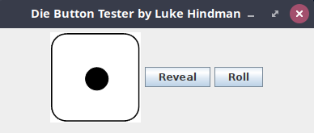

## Activity: Die Button
### Problem Description
In this activity you will be using the Die class that we developed earlier in the semester. This is an example of code reuse which is a core principle of Object Oriented Programming. For this activity you will create a class named DieButton that will extend the JButton class and will have a Die object as an instance variable to maintain state. The DieButton will contain a private inner class (child class) that will implement the ActionListener interface. Each time the button is clicked this listener will roll the internal Die and update the icon on the face of the button with a graphical representation of the face value of the Die. The constructor for the DieButton class takes an int for the desired number of sides and a String[] with the file paths of png images with the indexes corresponding to the die face values. The image at index 0 will be used to represent a blank die.

To test this DieButton class, you will write a DieButtonTester driver class that will setup a JFrame and well as a top level JPanel. The code will then instantiate a new instance of the DieButton class with 6 sides using the images provided in the d6-images folder. It should also enable the hide after roll functionality described in the requirements below. The UI should provide both a Roll and a Reveal button.  When the Roll button is clicked, the listener should call the rollDie() method described below.  When the Reveal button is clicked, the listener should call the showFace() method described below.



### Requirements
The screenshot above shows a sample GUI for this activity.  You may use the same layout or design your own.  Either way, your DieButton must satisfy the following requirements

+ **DieButton()** The constructor must take an integer value for the number of sides and a String array that contains the file paths of png images with the indexes corresponding to the die face values. The image at index 0 will be used to represent a blank die.
+ **getFaceValue():** Return the integer face value of the internal Die object
+ **enableHidAfterRoll()** Set an internal flag that changes the DieButton face to blank (image at index 0) after each roll of the dice
+ **disableHidAfterRoll()** Reset an internal flag that updates the DieButton face to the image that cooresponds to the updated face value of the internal Die object after each roll.
+ **showFace():** Update the face image on the DieButton with the image that cooresponds to the current face value of the internal Die object
+ **rollDie()** Call the roll() method on the internal Die object.  If hide after roll flag is enabled, change the DieButton face image to blank (index 0) otherwise set the face image icon to the updated face value of the internal Die object after the roll has occurred.
+ **DieButtonListener class** call the rollDie() method when DieButton is clicked.

### Error Handling
The String[] that is passed to the DieButton constructor should always contain at least 1 more image file than the specified number of sides. This is because the image at index 0 should be a blank die image.  When the constructor is called, perform a check to ensure this is in-fact that case. If not, throw a new RuntimeException using the code below.

```
throw new java.lang.RuntimeException("Error: Die has more sides than faces");
```

