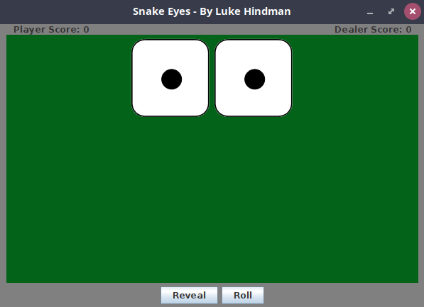

## Activity: Die Button
### Problem Description
In this activity you will use the DieButton class to create a simple dice game. The game consists of a single player, playing against the dealer. The player roles a pair of six sided dice and they earn a point if the sum of the dice is 7 or if doubles are rolled (except snake eyes). The dealter earns a point for all other rolls (except snake eyes).  If the player rolls snake eyes, the game ends and the player with the highest score wins.



### Requirements
The screenshot above shows a sample GUI for this activity.  You may use the same layout or design your own.  Either way, your SnakeEyes game must satisfy the following requirements

+ **DieButton** Instantiate two DieButton objects with six sides and the provided face images.
+ **JButton** Add a JButton with the text "Roll" that calls the rollDie() method on each DieButton object. The DieButton objects should be configured such that the result is not displayed until the "Reveal" button is clicked.
+ **JButton** Add a JButton with the text "Reveal" that first calls the showFace() method on each DieButton object, then calls the getFaceValue() method on each DieButton to get the current value of each.  The listener should then perform the necessary checks to determine whether the player or dealer earns a point and updated the approproate JLabel with the score. If snake eyes is rolled, the listener should display a JOptionPane with a message indicating the winner, then reset the score to play again.
+ **JLabel** Two JLabels should be used to display the scores, as shown in the screenshot above.
+ **JOptionPane** A JOptionPane should be used to display the winner when the game is over.


### Error Handling
The String[] that is passed to the DieButton constructor should always contain at least 1 more image file than the specified number of sides. This is because the image at index 0 should be a blank die image.  When the constructor is called, perform a check to ensure this is in-fact that case. If not, throw a new RuntimeException using the code below.

```
throw new java.lang.RuntimeException("Error: Die has more sides than faces");
```

